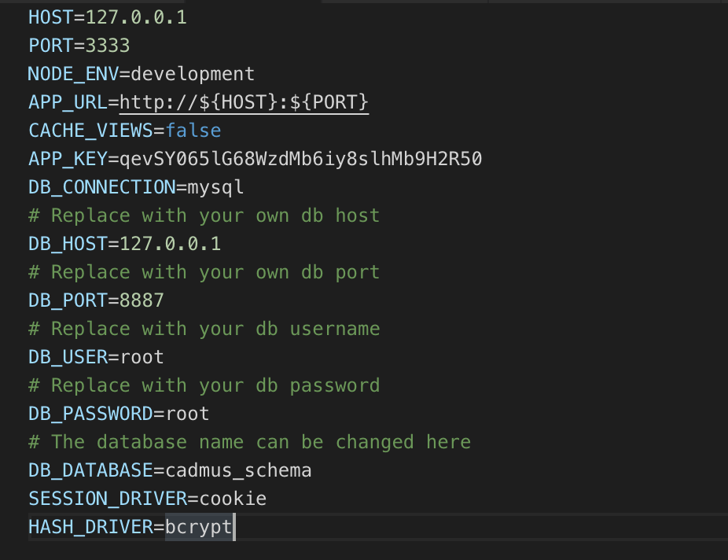
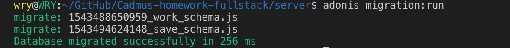
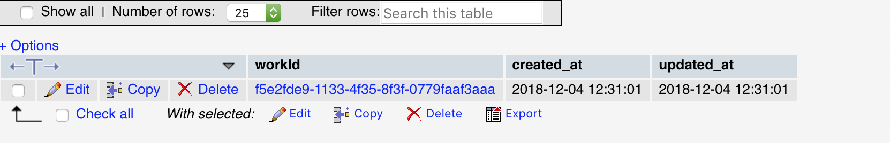
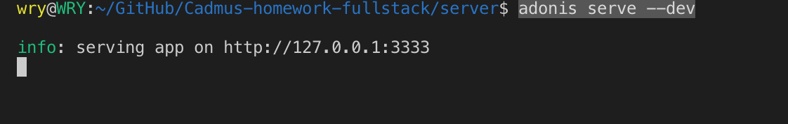

# Cadmus Homework Fullstack

## Considerations
- When input the URL path `/work/:workId/editing` to open the page at the beginning, because there is no save stored in the database, the save status in the top-right corner will be empty.
- The default content in the Body and Notes editor is from the body.json and notes.json files in the utils folder.
- A binary Work UUID is seeded by hand through a seed script and then pointing the URL to use that UUID.
- When the workId in the URL does not exist in the database, the changes you made will not displayed in the editor, only display the default content. If you continue make some changes in the editor, the "Fail to connect" alert will display.
- The auto saving will be triggered only when the content in the editor is changed every time, it won't be triggered when only the selection changes.
- For the backend server, two API were constructed for auto saving and loading the last save respectively. The routes are: `http://127.0.0.1:3333/api/saving` and `http://127.0.0.1:3333/api/loading/:workId`.


## Running of Server
This server application is created through `adonis new server`. The database used for backend is MySQL. Firstly, `cd` to the server folder

```
cd server
```
Install `mysql` dependency

```
npm install mysql --save
```
or just run `npm install`.

Open the `env`file, you need to set your database credentials in here:



Then create a database with the same database name in the env on your MySQL server.

Migrate the database schemas in the program to your database server. Run the following command to run startup migrations:

```
adonis migration:run
```
So the tables will be created in your database, the success migration will look as below:



To seed a single Work UUID in the Work table

```
adonis seed
```
A random binary UUID will be inserted into the Work table, you need to pointing the URL to use that UUID.



To run the development server:

```
adonis serve --dev
```
Adonis will try to serve for development on `http://127.0.0.1:3333` by default. 




## Package Added in Cliend Side
| Package        | Install           | Import  |
| -------------  |:-------------:    | -----:  |
| Axios | yarn add axios -- save | import axios from "axios";|